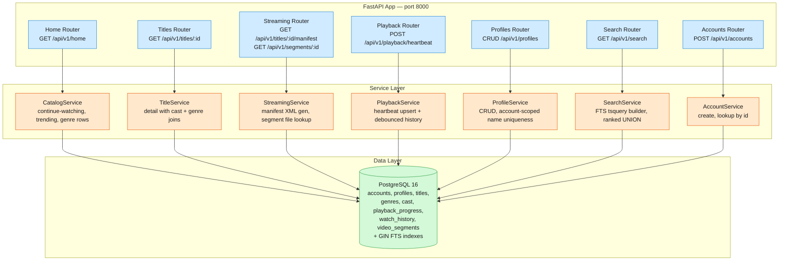

# Netflix MVP — Design & Architecture

An MVP streaming backend that implements the core Netflix browsing and playback loop. One FastAPI process serves REST endpoints backed by PostgreSQL for catalog data, user profiles, playback state, search, and mock video segment delivery. The MVP covers the personalized homepage with row-based listings, ABR-quality video streaming with mock segments, playback resume via heartbeat, multiple user profiles per account, and full-text search across title/genre/cast.

**Stack:** Python 3.12 / FastAPI / SQLAlchemy 2.0 (async) / PostgreSQL 16 / Alembic / Docker Compose

## Architecture



Routers parse HTTP, validate with Pydantic, and delegate to services — no business logic. Services own the domain logic and data access. No Redis or message queue at MVP scale — playback heartbeats and watch history write directly to Postgres.

## Requirements

### Functional

| FR | Description | Endpoint |
|----|-------------|----------|
| FR1 | Browse a catalog homepage with named rows (continue-watching, trending, per-genre) | `GET /api/v1/home` |
| FR2 | Full-text search across titles, genres, and cast members with relevance ranking | `GET /api/v1/search` |
| FR3 | Stream video segments with ABR quality adaptation (DASH manifest + mock segments) | `GET /api/v1/titles/{id}/manifest`, `GET /api/v1/segments/{id}` |
| FR4 | Resume playback from last position via heartbeat, reflected on homepage | `POST /api/v1/playback/heartbeat` |
| FR5 | Create and manage multiple user profiles per account (CRUD + cascade) | `CRUD /api/v1/profiles` |

**Supporting:** `POST /api/v1/accounts`, `GET /api/v1/accounts/{id}`, `GET /api/v1/titles/{id}`, `GET /healthz`

### Non-functional

- **Single-process stateless FastAPI** — horizontal scale by adding containers behind a load balancer
- **Postgres-only** — no Redis or external cache at MVP scale (< 1,000 titles, < 100 QPS)
- **Migrations on startup** — `alembic upgrade head` runs as the container CMD before uvicorn starts

### Out of scope

Real CDN delivery, DRM / license key exchange / offline downloads, recommendation ML / personalization, A/B testing, multi-region deployment, user authentication / OAuth, billing / subscription management, parental controls enforcement beyond maturity_rating, video encoding pipeline.

## Data Model

```
Account {
  account_id:  uuid PK             ← gen_random_uuid()
  email:       text UNIQUE
  created_at:  timestamp
}

Profile {
  profile_id:   uuid PK
  account_id:   uuid FK ⟶ Account   ← scopes profiles to account
  name:         text
  avatar_url:   text?
  is_kids:      boolean DEFAULT false
  created_at:   timestamp
  UNIQUE(account_id, name)           ← names unique within account
}

Title {
  title_id:        uuid PK
  title:           text
  synopsis:        text
  release_year:    integer CK ≥ 1888
  maturity_rating: text              ← G, PG, PG-13, R, NC-17
  poster_url:      text
  backdrop_url:    text
  title_type:      text              ← movie, series
  trending_score:  float DEFAULT 0   ← denormalized for trending sort
  fts_vector:      tsvector GIN      ← to_tsvector(title || ' ' || synopsis)
  created_at:      timestamp
}

Genre {
  genre_id:   uuid PK
  name:       text UNIQUE
  fts_vector: tsvector GIN           ← to_tsvector(name)
}

TitleGenre {                         ← many-to-many
  title_id: uuid PK FK ⟶ Title
  genre_id: uuid PK FK ⟶ Genre
}

CastMember {
  cast_id:    uuid PK
  name:       text
  fts_vector: tsvector GIN           ← to_tsvector(name)
}

TitleCast {                          ← many-to-many with role
  title_id: uuid PK FK ⟶ Title
  cast_id:  uuid PK FK ⟶ CastMember
  role:     text
  UNIQUE(title_id, cast_id, role)
}

PlaybackProgress {
  progress_id:       uuid PK
  profile_id:        uuid FK ⟶ Profile
  title_id:          uuid FK ⟶ Title
  position_seconds:  integer DEFAULT 0
  updated_at:        timestamp
  UNIQUE(profile_id, title_id)       ← one row per profile+title
}

WatchHistory {
  history_id:  uuid PK
  profile_id:  uuid FK ⟶ Profile
  title_id:    uuid FK ⟶ Title
  watched_at:  timestamp DEFAULT now()
}

VideoSegment {
  segment_id:       uuid PK
  title_id:         uuid FK ⟶ Title
  quality:          text             ← 1080p, 720p, 480p, 240p
  segment_index:    integer
  file_path:        text             ← path to mock .ts file
  duration_seconds: integer
  size_bytes:       integer
  UNIQUE(title_id, quality, segment_index)
}
```

10 tables, 4 GIN FTS indexes (titles, genres, cast_members), 5 UNIQUE constraints, 7 FK constraints.

## API Reference

- `GET /healthz` — Liveness probe. Returns `200 {"status": "ok"}`. Used by compose healthcheck.
- `POST /api/v1/accounts` — Create account. Body: `{email}`. `201 {account_id, email, created_at}`. Errors: `409` on duplicate email.
- `GET /api/v1/accounts/{account_id}` — Get account. `200 {...}`. Errors: `404`.
- `GET /api/v1/home?profile_id=<uuid>` — Catalog homepage. Continue-watching (up to 10), trending (up to 20 by score), genre rows (top 6 genres × 10 titles each). Errors: `404`.
- `GET /api/v1/titles/{title_id}` — Title detail with cast and genres. Errors: `404`.
- `GET /api/v1/titles/{title_id}/manifest` — MPEG-DASH manifest XML. Errors: `404`.
- `GET /api/v1/segments/{segment_id}` — Raw video bytes (video/mp2t). Errors: `404`.
- `POST /api/v1/playback/heartbeat` — Upsert playback progress + debounced WatchHistory. Body: `{profile_id, title_id, position_seconds}`. `200 {...}`. Errors: `404` on missing profile/title, `422` on negative position.
- `GET /api/v1/profiles?account_id=<uuid>` — List profiles. `200 {profiles: [...]}`. Errors: `404`.
- `POST /api/v1/profiles` — Create profile. Body: `{account_id, name, avatar_url?, is_kids?}`. `201 {...}`. Errors: `404`, `409`, `422`.
- `PUT /api/v1/profiles/{profile_id}` — Partial update. `200 {...}`. Errors: `404`, `409`.
- `DELETE /api/v1/profiles/{profile_id}` — Delete + cascade playback data. `204`. Errors: `404`.
- `GET /api/v1/search?q=<query>&limit=20` — FTS across titles, genres, cast. `websearch_to_tsquery` + `ts_rank` with 1.2× recency boost. Cap: 50. Empty query: `{results: []}`.

## Deep Dives

### D1: Caching — Postgres-only vs. Redis

**Decision:** Postgres-only at MVP scale. Redis adds operational complexity with zero latency benefit.

At < 1,000 titles, < 100 profiles, and single-digit QPS, the homepage queries are indexed Postgres scans completing in < 10ms. Redis adds another service in compose, another health check, another failure mode, and stale-invalidation logic. The full Netflix design uses EVCache (~22K Memcached servers, ~14 PB) with 15-minute pre-computation for homepage rows, but that becomes necessary at 10K+ titles or 100+ QPS — beyond MVP scale.

**Trade-off:** Latency degrades linearly with catalog size. If the homepage JOINs grow expensive, the fix is EVCache — but only becomes necessary at 10K+ titles. Postgres-only is intentionally the simplest thing that works; Redis can be layered in later without API changes.

### D2: WatchHistory debounce — inline timestamp check vs. session table

**Decision:** Debounce via SELECT on last `watched_at`. Skip insert if last entry is < 30s old. No session table.

Heartbeats fire every 5–10 seconds. Without debounce, a 90-minute film generates ~1,000 WatchHistory rows. A 30-second cooldown reduces this to ~180 rows per viewing session — clean signal without table flooding.

**Alternative:** A `PlaybackSession` table with `started_at`/`ended_at` would be semantically cleaner but adds lifecycle management that the MVP's stateless client never triggers.

**Edge case:** User pauses for 2 minutes, then resumes. The debounce inserts a new WatchHistory row after the 30s gap — correct behavior.

### D3: Mock segments — shared files vs. per-title encoding

**Decision:** One small .ts file per quality level (~4 KB each). Every segment of every title at a given quality points to the same file.

Real MPEG-TS segments require a video encoding pipeline generating ~1,200 output files per title. For MVP, the player needs valid bytes with the right Content-Type to exercise ABR switching and DASH manifest parsing. One TS file per quality is sufficient.

**Tip:** The `VideoSegment` model stores metadata (index, duration, size) used by the manifest generator. The actual bytes come from shared files in `data/segments/`. Each quality level has exactly one file: `mock_1080p.ts`, `mock_720p.ts`, `mock_480p.ts`, `mock_240p.ts`.

**Trade-off:** All segments at a given quality report identical duration and size — the player cannot use actual download times for bandwidth estimation. Production would encode real segments with varying sizes and serve them from a CDN.

### D4: Profile name uniqueness — account-scoped vs. global

**Decision:** `UNIQUE(account_id, name)` enforced at the database and service layer.

Two profiles on the same account cannot share a name, but millions of accounts can each have a "Kids" profile. The service layer catches `IntegrityError` on INSERT/UPDATE and returns HTTP 409.

**Edge cases:** Rename to a name used by another profile on the same account ⟶ 409. Rename to a name used by a different account ⟶ OK.

### D5: FTS — three tsvector columns vs. single denormalized column

**Decision:** Three separate generated `tsvector` columns (titles, genres, cast_members) with GIN indexes. Search UNIONs across all three with `ts_rank` ordering and recency boost.

A single denormalized tsvector on titles would simplify the query but duplicate data — changing a cast member's name would require updating every title they appear in. Separate columns keep data normalized and allow per-source ranking weights.

**Ranking:** `ts_rank(fts_vector, query)` with 1.2× multiplier for titles from the last 90 days. Parsed via `websearch_to_tsquery` for user-friendly query syntax.

**Trade-off:** Three indexes to maintain on INSERT/UPDATE. At MVP scale with infrequent catalog changes, write overhead is negligible. Production uses Elasticsearch — Postgres FTS handles MVP-scale catalogs (15K titles) comfortably.

### D6: Pagination — no cursor pagination

**Decision:** Fixed LIMITs per request. No cursor/pagination support.

The Netflix homepage is a fixed layout (~360 titles). Search caps at 50 results. Cursor pagination with stable sort order, cursor token encoding, and concurrent-insert handling is premature complexity for endpoints that never serve deep pagination.

**Trade-off:** If the catalog grows to 100K+ titles, search pagination becomes necessary. The fix is cursor-based pagination with `(score, title_id)` as the composite cursor key.

## Module Layout

```
src/netflix/
├── main.py                 # create_app() factory, lifespan, all router mounts
├── config.py               # pydantic-settings (env-driven)
├── database.py             # async engine, session factory, get_session()
├── models/
│   ├── base.py             # DeclarativeBase, UUID pk helper, TimestampMixin
│   ├── account.py          # Account ORM
│   ├── profile.py          # Profile ORM + UNIQUE(account_id, name)
│   ├── title.py            # Title ORM + fts_vector GIN + trending_score index
│   ├── genre.py            # Genre + TitleGenre (many-to-many)
│   ├── cast.py             # CastMember + TitleCast (many-to-many with role)
│   ├── playback.py         # PlaybackProgress + WatchHistory
│   └── segment.py          # VideoSegment + UNIQUE(title_id, quality, segment_index)
├── schemas/
│   ├── account.py          # AccountCreate, AccountCreateRequest, AccountResponse
│   ├── home.py             # HomePageResponse, ContinueWatchingItem, TrendingItem, GenreRow
│   ├── title.py            # TitleDetailResponse, TitleListItem, CastMemberOut, GenreOut
│   ├── profile.py          # ProfileCreate, ProfileUpdate, ProfileResponse
│   ├── playback.py         # HeartbeatRequest, HeartbeatResponse
│   └── search.py           # SearchResult, SearchResponse
├── routers/
│   ├── health.py           # GET /healthz
│   ├── accounts.py         # POST /api/v1/accounts, GET /api/v1/accounts/{id}
│   ├── home.py             # GET /api/v1/home
│   ├── titles.py           # GET /api/v1/titles/{id}
│   ├── streaming.py        # GET /api/v1/titles/{id}/manifest, GET /api/v1/segments/{id}
│   ├── playback.py         # POST /api/v1/playback/heartbeat
│   ├── profiles.py         # CRUD /api/v1/profiles
│   └── search.py           # GET /api/v1/search
└── services/
    ├── account_service.py      # create + duplicate check
    ├── catalog_service.py      # homepage row assembly (3 queries)
    ├── title_service.py        # title detail with eager-loaded cast/genre
    ├── streaming_service.py    # MPD XML generation + segment file I/O
    ├── playback_service.py     # heartbeat upsert + debounced watch history
    ├── profile_service.py      # CRUD + account-scoped name uniqueness
    └── search_service.py       # FTS query builder (websearch_to_tsquery, UNION, ts_rank)
```

## Per-FR Flows

### FR1: Browse catalog homepage

1. Client calls `GET /api/v1/home?profile_id=P1`.
2. CatalogService verifies profile exists (404 if not).
3. Three queries run in parallel:

**Continue-watching — DISTINCT ON, most recent first, LIMIT 10:**
```sql
SELECT DISTINCT ON (wh.title_id)
    t.title_id, t.title, t.poster_url, t.maturity_rating,
    COALESCE(pp.position_seconds, 0) AS position_seconds
FROM watch_history wh
JOIN titles t ON t.title_id = wh.title_id
LEFT JOIN playback_progress pp
    ON pp.profile_id = wh.profile_id AND pp.title_id = wh.title_id
WHERE wh.profile_id = :profile_id
ORDER BY wh.title_id, wh.watched_at DESC
LIMIT 10
```

**Trending — ORDER BY trending_score DESC, LIMIT 20.**

**Genre rows — top 6 genres by title count, 10 highest-trending titles each (Window function ROW_NUMBER partitioned by genre_id).**

4. Results assembled into `HomePageResponse`. All three queries complete in < 50ms at MVP scale.

### FR2: Search content

1. Client calls `GET /api/v1/search?q=action+comedy&limit=20`.
2. SearchService converts query via `websearch_to_tsquery('english', :query)` and UNIONs three sub-queries across titles (title + synopsis), genres (name), and cast members (name).
3. Results ranked by `ts_rank` with 1.2× multiplier for titles from the last 90 days.
4. Empty query returns `{results: []}`. Limit caps at 50.

### FR3: Stream video with ABR

1. Client fetches manifest: `GET /api/v1/titles/{title_id}/manifest`.
2. StreamingService queries `video_segments`, groups by quality, builds MPEG-DASH .mpd XML with one AdaptationSet per quality level.
3. Each AdaptationSet contains SegmentTimeline with `S` elements linking to `/api/v1/segments/{segment_id}`.
4. Client selects quality, fetches segment bytes. Segment endpoint reads the mock .ts file from disk and returns with `Content-Type: video/mp2t`.

### FR4: Resume playback

1. Client sends `POST /api/v1/playback/heartbeat` every 5–10s.
2. PlaybackService upserts `PlaybackProgress` via `INSERT ... ON CONFLICT (profile_id, title_id) DO UPDATE SET position_seconds = :p, updated_at = now()`.
3. WatchHistory is debounced: checks last `watched_at` for this profile+title. Inserts only if gap > 30s.
4. Homepage continue-watching row shows each title with its current `position_seconds`.

### FR5: Manage profiles

1. `GET /api/v1/profiles?account_id=<uuid>` — list profiles ordered by `created_at`.
2. `POST /api/v1/profiles` — verify account exists (404), check `UNIQUE(account_id, name)` constraint (409), insert, return 201.
3. `PUT /api/v1/profiles/{profile_id}` — partial update with same uniqueness check.
4. `DELETE /api/v1/profiles/{profile_id}` — manual cascade: deletes playback_progress and watch_history rows for the profile, then deletes the profile. Returns 204.
