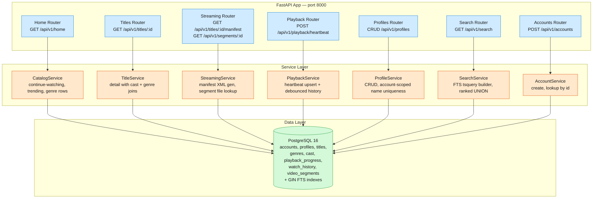

# Netflix MVP

An MVP streaming backend — catalog browsing, full-text search, ABR video streaming with mock segments, playback resume via heartbeat, and multi-profile management.

**Stack:** FastAPI + SQLAlchemy 2.0 (async) + PostgreSQL 16 + Alembic + Docker Compose

## Quick Start

```bash
# 1. Start the full stack (app + postgres)
docker compose up -d --build

# 2. Check health
curl http://localhost:8010/healthz
# → {"status": "ok"}

# 3. Create an account + profile (seed data exists for testing)
curl -X POST http://localhost:8010/api/v1/accounts \
  -H "Content-Type: application/json" \
  -d '{"email": "demo@test.com"}'

# 4. Browse the catalog homepage
curl "http://localhost:8010/api/v1/home?profile_id=<profile-uuid>"

# 5. Run acceptance tests
pip install httpx pytest
API_BASE_URL=http://localhost:8010 pytest verify/acceptance -q
```

## Architecture



## API Overview

| Method | Path | Description |
|--------|------|-------------|
| GET | `/healthz` | Liveness probe |
| POST | `/api/v1/accounts` | Create account |
| GET | `/api/v1/accounts/{id}` | Get account |
| GET | `/api/v1/home?profile_id=` | Catalog homepage (continue-watching, trending, genre rows) |
| GET | `/api/v1/titles/{id}` | Title detail with cast and genres |
| GET | `/api/v1/titles/{id}/manifest` | DASH manifest XML |
| GET | `/api/v1/segments/{id}` | Raw video segment bytes |
| POST | `/api/v1/playback/heartbeat` | Upsert playback position |
| GET | `/api/v1/profiles?account_id=` | List profiles |
| POST | `/api/v1/profiles` | Create profile |
| PUT | `/api/v1/profiles/{id}` | Update profile |
| DELETE | `/api/v1/profiles/{id}` | Delete profile + cascade playback data |
| GET | `/api/v1/search?q=&limit=` | Full-text search |

## Test Suite

| Suite | Type | What it covers |
|-------|------|----------------|
| `tests/` | White-box (unit + integration) | AccountService (4), ProfileService (8), PlaybackService (2) |
| `verify/acceptance/` | Black-box (HTTP-only) | Health check, FR1-FR5, error paths |

**Run unit tests:**
```bash
pip install -e ".[dev]"
# Requires Postgres — see DEPLOY.md for local setup
pytest tests/ -q -v
```

**Run acceptance tests (requires running stack via docker compose):**
```bash
pip install httpx pytest
API_BASE_URL=http://localhost:8010 pytest verify/acceptance -q -v
```

## Project Structure

```
src/netflix/         # Application package (src layout)
├── main.py          # FastAPI app factory + lifespan
├── config.py        # pydantic-settings configuration
├── database.py      # Async engine, session factory, get_session dependency
├── models/          # SQLAlchemy ORM models (10 tables)
├── schemas/         # Pydantic request/response DTOs
├── routers/         # HTTP layer (thin — delegates to services)
└── services/        # Business logic + data access
tests/               # White-box unit/integration tests (14 tests)
verify/              # Black-box acceptance tests (per-FR, HTTP-only)
alembic/             # Migrations (001_initial + 002_seed)
docs/                # System design, MVP scope
data/segments/       # Mock .ts video segment files (240p → 1080p)
```

## CI/CD

| Workflow | Trigger | What it does |
|----------|---------|-------------|
| `lint.yml` | PRs to `main` | Ruff check + format check |
| `ci.yml` | PRs to `main` | Postgres service, migrations, 14 unit tests |
| `functional.yml` | Push to `main` | Full compose stack, migrations, acceptance tests |

## Environment Variables

See `.env.example` for all configurable settings. Override via docker-compose `environment:` or a local `.env` file.

| Variable | Default | Description |
|----------|---------|-------------|
| `APP_PORT` | `8010` | Host port mapped to app container |
| `DATABASE_URL` | `postgresql+asyncpg://netflix:netflix@db:5432/netflix` | Asyncpg connection string |
| `HOST` | `0.0.0.0` | App bind address (inside container) |
| `PORT` | `8000` | App listen port (inside container) |
| `LOG_LEVEL` | `INFO` | Log verbosity |
| `CORS_ORIGINS` | `*` | Allowed CORS origins |
| `MOCK_SEGMENTS_DIR` | `/app/data/segments` | Mock .ts segment directory |

## Design Decisions

- **Postgres-only** — no Redis cache at MVP scale (sub-1000 titles, sub-100 QPS). Homepage queries complete in <10ms with indexed scans.
- **Debounced WatchHistory** — heartbeats fire every 5–10s; insert only if last entry is > 30s old. Prevents ~1000 rows per film becoming ~180.
- **Mock segments** — one ~4KB file per quality level (240p/480p/720p/1080p); all titles share the same files. The player receives valid MPEG-TS bytes and can exercise ABR switching.
- **Account-scoped profile names** — `UNIQUE(account_id, name)` matches Netflix's real constraint. Two profiles on the same account cannot share a name.
- **Three FTS tsvector columns** — titles, genres, and cast_members each have their own GIN-indexed column; search UNIONs across all three with `ts_rank` scoring and recency boost.
- **No cursor pagination** — homepage is a fixed layout (~360 titles), search caps at 50 results. Deep pagination adds complexity with no product need.
