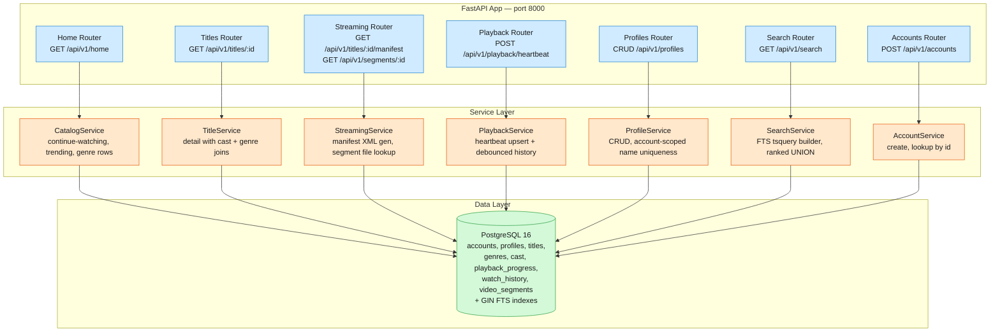

# Netflix MVP — Design & Module Layout

An MVP streaming backend that implements the core Netflix browsing and playback loop. One FastAPI process serves REST endpoints backed by PostgreSQL for catalog data, user profiles, playback state, search, and mock video segment delivery. The MVP covers the personalized homepage with row-based listings, ABR-quality video streaming with mock segments, playback resume via heartbeat, multiple user profiles per account, and full-text search across title/genre/cast — minus real CDN delivery, DRM, recommendation ML, offline downloads, A/B testing, and multi-region deployment.

The broader target — the full Netflix System Design — scales this to 325M+ subscribers with a global CDN (Open Connect, 14K+ appliances), hundreds of microservices for personalization and playback, Kafka event pipelines for telemetry, a tiered caching hierarchy (EVCache, ~22K servers), and an async encoding pipeline generating ~1,200 output files per title. This MVP implements the browsing-and-playback spine that everything else attaches to.

## Architecture



Routers parse HTTP, validate with Pydantic, and delegate to services — no business logic. Services own the domain logic and data access. No Redis or message queue at MVP scale — playback heartbeats and watch history write directly to Postgres. The homepage is assembled from indexed Postgres queries (continue-watching via DISTINCT ON, trending via indexed sort, genre rows via JOIN + subquery).

## Scope

### In scope

- FR1: Browse a catalog homepage with named rows — continue-watching, trending, and per-genre rows
- FR2: Full-text search across titles, genres, and cast members with relevance ranking
- FR3: Stream video segments with ABR quality adaptation — serve mock segments, generate DASH manifests
- FR4: Resume playback from last position — heartbeat endpoint + continue-watching row on homepage
- FR5: Create and manage multiple user profiles per account — CRUD with account-scoped name uniqueness
- Accounts: create and lookup (setup dependency for profiles)
- GET /healthz

### Out of scope

- Real CDN / edge delivery (mock segments served from the app)
- DRM / license key exchange / offline downloads (FR6)
- Recommendation engine / ML personalization (trending_score is a seeded column)
- A/B testing framework
- Multi-region / Open Connect appliance deployment
- User authentication / OAuth (account_id passed as request param)
- Billing / subscription management / plan tiers
- Parental controls beyond maturity_rating on titles (is_kids flag is stored, not enforced server-side in MVP)
- Video encoding pipeline (segments are pre-generated mock .ts files)

## Data Model

```sql
Account {
  account_id:  uuid PK
  email:       text UNIQUE
  created_at:  timestamp
}

Profile {
  profile_id:   uuid PK
  account_id:   uuid FK → Account    ← for listing all profiles on an account
  name:         text
  avatar_url:   text?
  is_kids:      boolean DEFAULT false
  created_at:   timestamp
  UNIQUE(account_id, name)           ← profile names unique within account
}

Title {
  title_id:          uuid PK
  title:             text
  synopsis:          text
  release_year:      integer
  maturity_rating:   text              ← G, PG, PG-13, R, NC-17
  poster_url:        text
  backdrop_url:      text
  title_type:        text              ← movie, series
  trending_score:    float DEFAULT 0   ← denormalized for trending row sort
  created_at:        timestamp
}

Genre {
  genre_id:  uuid PK
  name:      text UNIQUE
}

TitleGenre {
  title_id:  uuid PK FK → Title
  genre_id:  uuid PK FK → Genre
}

CastMember {
  cast_id:  uuid PK
  name:     text
}

TitleCast {
  title_id:  uuid PK FK → Title
  cast_id:   uuid PK FK → CastMember
  role:      text
}

PlaybackProgress {
  progress_id:       uuid PK
  profile_id:        uuid FK → Profile
  title_id:          uuid FK → Title
  position_seconds:  integer DEFAULT 0
  updated_at:        timestamp
  UNIQUE(profile_id, title_id)         ← one progress row per profile+title
}

WatchHistory {
  history_id:  uuid PK
  profile_id:  uuid FK → Profile
  title_id:    uuid FK → Title
  watched_at:  timestamp DEFAULT now()
}

VideoSegment {
  segment_id:       uuid PK
  title_id:         uuid FK → Title
  quality:          text              ← 1080p, 720p, 480p, 240p
  segment_index:    integer
  file_path:        text              ← path to mock .ts file on disk
  duration_seconds: integer
  size_bytes:       integer
  UNIQUE(title_id, quality, segment_index)
}
```

### Key schema decisions

- **`PlaybackProgress` has `UNIQUE(profile_id, title_id)`** — one row per profile+title pair. Heartbeat upserts into this row via `INSERT ... ON CONFLICT (profile_id, title_id) DO UPDATE`. Resume reads from it. No history table needed for the single-position use case.
- **`WatchHistory` is append-only** — each distinct viewing session inserts a row (debounced: at most one row per profile+title per 30 seconds). The continue-watching row on the homepage queries WatchHistory with `DISTINCT ON (title_id) ... ORDER BY watched_at DESC LIMIT 10` and LEFT JOINs PlaybackProgress for the current position.
- **`trending_score` is denormalized on Title** — the MVP hardcodes or seeds it. The full design would compute it from a streaming pipeline (Kafka → Flink) aggregating watch counts and recency signals. For MVP, a float with a descending index sorts the trending row.
- **`VideoSegment.file_path`** points to a pre-generated mock file under a static directory. The streaming router reads the file and returns raw bytes with `Content-Type: video/mp2t`. No S3/CDN needed. One mock .ts file per quality level is shared across all segments of all titles.
- **FTS uses generated `tsvector` columns** on `titles` (title || ' ' || synopsis), `genres` (name), and `cast_members` (name), each indexed with GIN. Search UNIONs across all three and ranks by `ts_rank` with a recency boost.
- **`Profile.name` is unique per account** via `UNIQUE(account_id, name)`. This matches Netflix's real product constraint — two profiles on the same account cannot share a name, but different accounts can each have a "Kids" profile.
- **`Account` is lightweight** — in the MVP it's just an id + email. No plan tier, payment info, or region. The account exists only to scope profiles.

## API Spec

### GET /healthz
Returns `200 {"status": "ok"}` when the app is alive. Used by compose healthcheck and e2e READY probe.

### POST /api/v1/accounts
Body: `{email}`
Creates an account. Email must be unique.
Response: `201 {account_id, email, created_at}`
Errors: `409` if email already registered. `422` if email empty or invalid.

### GET /api/v1/accounts/{account_id}
Returns account by id.
Response: `200 {account_id, email, created_at}`
Errors: `404` if not found.

### GET /api/v1/home?profile_id=<uuid>
Catalog homepage. Returns a JSON object with named rows:
- `continue_watching`: up to 10 titles the profile recently watched, ordered by `watched_at DESC`, each with `position_seconds` from PlaybackProgress
- `trending`: up to 20 titles ordered by `trending_score DESC`
- `genre_rows`: list of `{genre_name, titles[]}` — top 6 genres by title count, 10 titles each (highest trending_score within the genre)

Response: `200 {continue_watching: [...], trending: [...], genre_rows: [{genre_name, titles: [...]}]}`
Errors: `404` if profile_id unknown.

### GET /api/v1/titles/{title_id}
Title detail. Returns full metadata including cast and genres.
Response: `200 {title_id, title, synopsis, release_year, maturity_rating, poster_url, backdrop_url, title_type, trending_score, cast: [{cast_id, name, role}], genres: [{genre_id, name}]}`
Errors: `404` if not found.

### GET /api/v1/titles/{title_id}/manifest
Returns an MPEG-DASH manifest (.mpd XML) with AdaptationSets per quality level and SegmentTimeline entries pointing to `GET /api/v1/segments/{segment_id}`.
Errors: `404` if title has no segments.

### GET /api/v1/segments/{segment_id}
Returns raw video bytes for a mock segment. Content-Type: `video/mp2t`.
The mock segment is a pre-generated .ts file (a few KB). The app reads from disk and streams the response.
Errors: `404` if segment not found.

### POST /api/v1/playback/heartbeat
Body: `{profile_id, title_id, position_seconds}`
Upserts into PlaybackProgress. Also inserts a row into WatchHistory (debounced: only if last WatchHistory row for this profile+title is > 30 seconds old).
Response: `200 {profile_id, title_id, position_seconds, updated_at}`
Errors: `404` if profile_id or title_id unknown. `422` if position_seconds < 0.

### GET /api/v1/profiles?account_id=<uuid>
List all profiles for an account.
Response: `200 {profiles: [{profile_id, name, avatar_url, is_kids, created_at}]}`
Errors: `404` if account_id unknown.

### POST /api/v1/profiles
Body: `{account_id, name, avatar_url?, is_kids?}`
Creates a new profile. Name must be unique within the account.
Response: `201 {profile_id, name, avatar_url, is_kids, created_at}`
Errors: `404` if account_id unknown. `409` if profile name already exists in account. `422` if name is empty.

### PUT /api/v1/profiles/{profile_id}
Body: `{name?, avatar_url?, is_kids?}`
Partial update. Name uniqueness enforced within the parent account.
Response: `200 {profile_id, name, avatar_url, is_kids, created_at}`
Errors: `404` if profile_id unknown. `409` if new name conflicts within account.

### DELETE /api/v1/profiles/{profile_id}
Deletes a profile and cascades: PlaybackProgress and WatchHistory rows for this profile are removed.
Response: `204 No Content`
Errors: `404` if not found.

### GET /api/v1/search?q=<query>&limit=20
Full-text search across titles (title + synopsis), genres, and cast members. Uses Postgres `websearch_to_tsquery` for user-friendly query parsing.
Results ranked by `ts_rank` with a recency boost (titles from the last 90 days get a 1.2× multiplier). Limit is default 20, capped at 50.
Response: `200 {results: [{type: "title"|"genre"|"cast", ...matched fields, score}]}`
Empty query returns `200 {results: []}`.

## High-Level Design — per-FR flows

### FR1: Browse catalog homepage

**Components:** Client → Home Router → CatalogService → Postgres.

**Flow:**
1. Client calls `GET /api/v1/home?profile_id=P1` on app launch.
2. CatalogService verifies profile exists (404 if not).
3. Three queries run in parallel:

**Continue-watching:**
```sql
SELECT DISTINCT ON (wh.title_id)
    t.title_id, t.title, t.poster_url, t.maturity_rating,
    COALESCE(pp.position_seconds, 0) AS position_seconds,
    wh.watched_at
FROM watch_history wh
JOIN titles t ON t.title_id = wh.title_id
LEFT JOIN playback_progress pp ON pp.profile_id = wh.profile_id AND pp.title_id = wh.title_id
WHERE wh.profile_id = $1
ORDER BY wh.title_id, wh.watched_at DESC
LIMIT 10
```

**Trending:**
```sql
SELECT title_id, title, poster_url, maturity_rating, trending_score
FROM titles
ORDER BY trending_score DESC
LIMIT 20
```

**Genre rows:**
```sql
-- Top 6 genres by title count; within each, top 10 titles by trending_score
WITH top_genres AS (
    SELECT g.genre_id, g.name, COUNT(*) AS title_count
    FROM genres g
    JOIN title_genres tg ON tg.genre_id = g.genre_id
    GROUP BY g.genre_id, g.name
    ORDER BY title_count DESC
    LIMIT 6
),
genre_titles AS (
    SELECT tg.genre_id, t.title_id, t.title, t.poster_url, t.maturity_rating,
           ROW_NUMBER() OVER (PARTITION BY tg.genre_id ORDER BY t.trending_score DESC) AS rn
    FROM title_genres tg
    JOIN titles t ON t.title_id = tg.title_id
    WHERE tg.genre_id IN (SELECT genre_id FROM top_genres)
)
SELECT tg.genre_id, g.name AS genre_name, gt.title_id, gt.title, gt.poster_url, gt.maturity_rating
FROM top_genres g
JOIN genre_titles gt ON gt.genre_id = g.genre_id AND gt.rn <= 10
ORDER BY g.title_count DESC, gt.rn
```

4. CatalogService assembles results into HomePageResponse. All three queries complete in <50ms with appropriate indexes.
5. No caching layer in MVP — queries run fresh each request. At MVP scale (<1000 titles, <100 profiles), Postgres handles this easily.

### FR2: Search content

**Components:** Client → Search Router → SearchService → Postgres (FTS).

**Flow:**
1. Client calls `GET /api/v1/search?q=action+comedy&limit=20`.
2. SearchService converts query to tsquery via `websearch_to_tsquery('english', $1)`.
3. UNIONs three sub-queries across tsvector columns:

```sql
SELECT 'title' AS type, t.title_id AS id, t.title AS display_name,
       ts_rank(t.fts_vector, query) *
         CASE WHEN t.release_year >= EXTRACT(YEAR FROM now()) - 1 THEN 1.2 ELSE 1.0 END AS score
FROM titles t, websearch_to_tsquery('english', $1) query
WHERE t.fts_vector @@ query

UNION ALL

SELECT 'genre' AS type, g.genre_id AS id, g.name AS display_name,
       ts_rank(g.fts_vector, query) AS score
FROM genres g, websearch_to_tsquery('english', $1) query
WHERE g.fts_vector @@ query

UNION ALL

SELECT 'cast' AS type, cm.cast_id AS id, cm.name AS display_name,
       ts_rank(cm.fts_vector, query) AS score
FROM cast_members cm, websearch_to_tsquery('english', $1) query
WHERE cm.fts_vector @@ query

ORDER BY score DESC
LIMIT $2
```

4. SearchService strips results where maturity_rating conflicts with the profile's is_kids flag (if profile_id provided as optional param). At MVP scale this is a post-filter on ≤50 rows.
5. Returns `{results: [...]}` with type, id, display_name, and score per result.

### FR3: Stream video with ABR

**Components:** Client → Streaming Router → StreamingService → Postgres + disk.

**Flow:**
1. Client calls `GET /api/v1/titles/{title_id}/manifest`.
2. StreamingService queries VideoSegment rows for the title:

```sql
SELECT segment_id, quality, segment_index, duration_seconds
FROM video_segments
WHERE title_id = $1
ORDER BY quality, segment_index
```

3. Generates an MPEG-DASH .mpd manifest XML with one AdaptationSet per quality level. Each AdaptationSet contains a SegmentTimeline with S elements pointing to `/api/v1/segments/{segment_id}`.
4. Client parses the manifest, selects an initial quality based on estimated bandwidth, and fetches segments: `GET /api/v1/segments/{segment_id}`.
5. The segment endpoint looks up the segment row, reads the mock .ts file from `file_path` on disk, and returns the bytes with `Content-Type: video/mp2t`.
6. Mock .ts files are pre-generated — one 4 KB file per quality level stored in a static directory. Every segment of every title at a given quality reuses the same file. The player receives valid MPEG-TS bytes and can exercise its ABR switching logic.

### FR4: Resume playback

**Components:** Client → Playback Router → PlaybackService → Postgres.

**Flow:**
1. During playback, client sends `POST /api/v1/playback/heartbeat` every 5–10 seconds with `{profile_id, title_id, position_seconds}`.
2. PlaybackService upserts PlaybackProgress:

```sql
INSERT INTO playback_progress (progress_id, profile_id, title_id, position_seconds, updated_at)
VALUES (gen_random_uuid(), $1, $2, $3, now())
ON CONFLICT (profile_id, title_id)
DO UPDATE SET position_seconds = $3, updated_at = now()
```

3. Debounced WatchHistory insert: query for the most recent WatchHistory row for this profile+title. If `now() - watched_at > 30 seconds` (or no row exists), insert a new row. This prevents flooding WatchHistory with one row per heartbeat while still recording distinct viewing sessions.
4. When the homepage loads (FR1), the continue-watching row shows each title with its current `position_seconds` from PlaybackProgress. The client resumes from that position.

### FR5: Manage profiles

**Components:** Client → Profiles Router → ProfileService → Postgres.

**Flow:**
1. `GET /api/v1/profiles?account_id=<uuid>` — list all profiles for the account.
2. `POST /api/v1/profiles` with `{account_id, name, ...}` — ProfileService checks account exists (404 if not), checks name uniqueness within account via UNIQUE constraint (409 on conflict), inserts profile, returns 201.
3. `PUT /api/v1/profiles/{profile_id}` — partial update. If name changes, checks uniqueness within the profile's parent account.
4. `DELETE /api/v1/profiles/{profile_id}` — deletes the profile and cascades: `DELETE FROM playback_progress WHERE profile_id = $1`, `DELETE FROM watch_history WHERE profile_id = $1`, then `DELETE FROM profiles WHERE profile_id = $1`. Returns 204.

## Key Design Decisions

### D1: Postgres-only vs. Postgres + Redis

**Decision:** Postgres-only — no Redis or external cache at MVP scale.

The full design uses EVCache (~22K Memcached servers, ~14 PB) for pre-computed homepage rows and Redis for real-time counters. At MVP scale (<1000 titles, <100 profiles, single-digit QPS), a Redis cache would add operational complexity (another service in compose, another healthcheck, another failure mode) with no latency benefit — the homepage queries are indexed Postgres scans completing in <10ms.

**Trade-off:** If the homepage row assembly grows expensive (complex JOINs across large tables), latency degrades linearly with catalog size. The production fix is EVCache with 15-minute pre-computation — but that only becomes necessary at 10K+ titles or 100+ QPS, well beyond MVP scale. The Postgres-only approach is intentionally the simplest thing that works; Redis can be layered in later without API changes.

### D2: WatchHistory debounce — timestamp check vs. separate table

**Decision:** Debounce WatchHistory inserts by checking the last entry's `watched_at` — skip if within 30 seconds of the current heartbeat. No separate session table.

Heartbeats fire every 5–10 seconds. Without debounce, a 90-minute film generates ~1,000 WatchHistory rows. A 30-second cooldown reduces this to ~180 rows per viewing session — a clean signal for "this profile watched this title recently" without drowning the table.

**Alternative considered:** A `PlaybackSession` table with `started_at` / `ended_at` would be cleaner semantically but adds a lifecycle (session start, session end) that the MVP's mock player doesn't trigger. The heartbeat is the only signal.

**Trade-off:** The debounce check adds a SELECT before every INSERT — an extra round-trip. At MVP QPS this is invisible. The full design would use a Kafka stream with windowed deduplication; MVP implements it inline.

### D3: Mock video segments — shared files vs. per-title files

**Decision:** Pre-generate one small .ts file per quality level (~4 KB each) and reuse it for every segment of every title.

Real MPEG-TS segments would require a video encoding pipeline generating ~1,200 output files per title. For MVP, the player just needs valid bytes with the right Content-Type. One TS initialization segment per quality is sufficient. The `VideoSegment.file_path` column points to the same file for every segment; `segment_index` and `duration_seconds` are metadata only.

**Trade-off:** All segments at a given quality report identical duration and size — the player's ABR algorithm cannot use actual segment download times to estimate bandwidth. For MVP acceptance testing, the player receives valid bytes and the manifest is well-formed XML; bandwidth estimation is the player's responsibility. Production would use real encoded segments with varying sizes.

### D4: Profile name uniqueness — account-scoped vs. global

**Decision:** Profile names must be unique within an account, enforced by `UNIQUE(account_id, name)`.

Netflix's real product enforces this — two profiles on the same account cannot share a name, but millions of accounts can each have a "Kids" profile. A global uniqueness constraint would be wrong. The service layer catches `IntegrityError` on INSERT/UPDATE and returns 409.

### D5: FTS — three tsvector columns vs. single denormalized column

**Decision:** Three separate generated `tsvector` columns on `titles`, `genres`, and `cast_members` with GIN indexes. Search UNIONs across all three.

A single denormalized tsvector on titles (concatenating genre names and cast names) would simplify the query but duplicate data — a cast member name change would require updating every title they appear in. Separate columns keep the data normalized. The UNION with `ts_rank` per source allows weighting (titles rank higher than genres for exact matches).

**Trade-off:** Three tsvector columns × GIN indexes = three indexes to maintain on INSERT/UPDATE. At MVP scale with infrequent catalog changes, the write overhead is negligible. The full design uses Elasticsearch for search; Postgres FTS handles the MVP comfortably.

### D6: Cursor pagination — not implemented in MVP

**Decision:** No cursor pagination for homepage or search results. Fixed LIMITs per request (10 continue-watching, 20 trending, 10 per genre row, 20–50 search results).

Cursor pagination is essential for infinite-scroll feeds (Twitter timeline) where users scroll dozens of pages deep. The Netflix homepage is a fixed layout — ~30 rows × ~12 titles = 360 title references on one page. No "next page" button exists in the product. Search is capped at 50 results — a second page is rare for a 15K-title catalog. Adding cursor encode/decode for endpoints that don't need deep pagination is premature complexity.

**Trade-off:** If the catalog grows to 100K+ titles, search pagination becomes necessary. The MVP accepts the limitation; production would add cursor-based pagination with `(score, title_id)` as the cursor key.

## Module Layout

```
src/netflix/
├── __init__.py
├── main.py                 # create_app() factory, lifespan, /healthz router mount
├── config.py               # Settings (pydantic-settings, env-driven)
├── database.py             # async engine/session factory, get_session dependency
├── models/
│   ├── __init__.py
│   ├── base.py             # DeclarativeBase, common mixins (UUID pk, timestamps)
│   ├── account.py          # Account ORM model
│   ├── profile.py          # Profile ORM model + UNIQUE(account_id, name)
│   ├── title.py            # Title ORM model + FTS tsvector generated column + GIN index
│   ├── genre.py            # Genre, TitleGenre ORM models
│   ├── cast.py             # CastMember, TitleCast ORM models
│   ├── playback.py         # PlaybackProgress (UNIQUE profile+title), WatchHistory ORM models
│   └── segment.py          # VideoSegment ORM model + UNIQUE(title_id, quality, segment_index)
├── schemas/
│   ├── __init__.py
│   ├── account.py          # AccountCreate, AccountResponse
│   ├── home.py             # HomePageResponse, ContinueWatchingItem, TrendingItem, GenreRow
│   ├── title.py            # TitleDetailResponse, TitleListItem, CastMemberOut, GenreOut
│   ├── profile.py          # ProfileCreate, ProfileUpdate, ProfileResponse
│   ├── playback.py         # HeartbeatRequest, HeartbeatResponse
│   └── search.py           # SearchResult, SearchResponse
├── routers/
│   ├── __init__.py
│   ├── health.py           # GET /healthz
│   ├── accounts.py         # POST /api/v1/accounts, GET /api/v1/accounts/{id}
│   ├── home.py             # GET /api/v1/home
│   ├── titles.py           # GET /api/v1/titles/{id}
│   ├── streaming.py        # GET /api/v1/titles/{id}/manifest, GET /api/v1/segments/{id}
│   ├── playback.py         # POST /api/v1/playback/heartbeat
│   ├── profiles.py         # CRUD /api/v1/profiles
│   └── search.py           # GET /api/v1/search
└── services/
    ├── __init__.py
    ├── account_service.py      # Account create, lookup
    ├── catalog_service.py      # Homepage row assembly (3 parallel queries)
    ├── title_service.py        # Title detail with cast/genre eager-loading
    ├── streaming_service.py    # Manifest XML generation, segment file lookup + serve
    ├── playback_service.py     # Heartbeat upsert + debounced watch history insert
    ├── profile_service.py      # Profile CRUD + account-scoped name uniqueness check
    └── search_service.py       # FTS query builder (websearch_to_tsquery, UNION, ts_rank, recency boost)
```

## Build Plan

Each numbered task below is a kanban card for the build phase. The architect has already produced `design.md`, `verify/acceptance/`, and `verify/manifest.env` — the chain picks up at task 1.

### Tier: staff

1. **Data model & Alembic initial migration** — All ORM models: Account, Profile, Title, Genre, TitleGenre, CastMember, TitleCast, PlaybackProgress, WatchHistory, VideoSegment. All constraints (FKs, UNIQUE on email, UNIQUE on account_id+name, UNIQUE on genre name, UNIQUE on profile_id+title_id, UNIQUE on title_id+quality+segment_index). GIN indexes on FTS tsvector columns (titles, genres, cast_members). Alembic `001_initial` migration + seed data migration `002_seed` that creates 1 account + 3 profiles, ~30 titles across 6 genres with cast members, video segment rows per title (4 quality levels, 5 segments each), and mock .ts files. This is the foundation every other task builds on — must be correct and complete from the start.

2. **FR1 — Catalog homepage** — `services/catalog_service.py`, `routers/home.py`, `schemas/home.py`. Continue-watching query (DISTINCT ON title_id, ORDER BY watched_at DESC, LIMIT 10, LEFT JOIN PlaybackProgress). Trending query (ORDER BY trending_score DESC, LIMIT 20). Genre rows (top 6 genres by title count, 10 highest-trending titles each). All three assembled into a single HomePageResponse.

3. **FR4 — Playback heartbeat + resume** — `services/playback_service.py`, `routers/playback.py`, `schemas/playback.py`. Heartbeat upserts PlaybackProgress (INSERT ON CONFLICT UPDATE). Debounced WatchHistory insert: check last entry for this profile+title, skip if < 30 seconds ago. The continue-watching row in FR1 reads from these tables.

4. **FR3 — ABR streaming** — `services/streaming_service.py`, `routers/streaming.py`. Manifest generation: query segments for title_id, build MPD XML with AdaptationSets per quality, SegmentTimeline entries pointing to `/api/v1/segments/{segment_id}`. Segment serving: lookup segment by id, read mock .ts file from disk, return with `video/mp2t` Content-Type.

### Tier: senior

5. **Scaffold project skeleton** — `pyproject.toml`, `src/netflix/` package, `config.py`, `database.py`, `main.py` with `create_app()` + `/healthz`, `.env.example`, `.gitignore`. App boots and `/healthz` returns 200.

6. **FR5 — Profile CRUD + accounts** — `models/account.py`, `models/profile.py`, `schemas/account.py`, `schemas/profile.py`, `services/account_service.py`, `services/profile_service.py`, `routers/accounts.py`, `routers/profiles.py`. Full profile CRUD with account-scoped name uniqueness (409 on conflict), cascade delete of playback data. Account create + lookup.

7. **FR2 — Full-text search** — `schemas/search.py`, `services/search_service.py`, `routers/search.py`. `websearch_to_tsquery`, UNION across titles + genres + cast_members tsvector columns, ts_rank ordering with recency boost. Results capped at default 20, max 50.

8. **Docker, Compose & Deploy** — Multi-stage `Dockerfile` (python:3.12-slim), `docker-compose.yml` with `db` (Postgres 16) + `app` services, healthchecks on both, `APP_PORT` override. Alembic auto-upgrade on startup (or compose `command:` override). `DEPLOY.md` with first-run instructions.

9. **White-box tests** — `tests/conftest.py` + per-service test files under `tests/`. Cover: catalog row assembly (all three rows populated), heartbeat upsert logic, debounce timer (WatchHistory insert gating), profile name uniqueness enforcement, FTS query building with ts_rank, manifest XML well-formedness, segment byte serving.

10. **README + docs** — `README.md` (stack, quick start, API table), `docs/system-design.md` (the full target design from Notion), `docs/mvp-scope.md` (this exact cut).

## Acceptance Tests

The `verify/acceptance/` directory contains one executable black-box test file per functional requirement. All tests talk to the running system at `API_BASE_URL` via `httpx` — no app imports. Created as part of this architect card.

| File | FR | What it asserts |
|---|---|---|
| `test_healthz.py` | Health | GET /healthz → 200 |
| `test_fr1_catalog_homepage.py` | FR1 | Homepage returns continue_watching, trending, genre_rows with valid structure; 404 for unknown profile; continue_watching shows positions after heartbeat |
| `test_fr2_search.py` | FR2 | Search by title keyword finds matches; search by genre name finds genre; search by cast name finds cast member; results include score; empty query returns empty results; limit is honored |
| `test_fr3_abr_streaming.py` | FR3 | Manifest returns valid XML with AdaptationSets and SegmentTimeline entries; segment endpoint returns bytes with video/mp2t Content-Type; 404 for unknown title manifest; 404 for unknown segment |
| `test_fr4_playback_resume.py` | FR4 | Heartbeat upserts position; subsequent heartbeat updates position; 404 for unknown profile; 404 for unknown title; 422 for negative position |
| `test_fr5_profile_management.py` | FR5 | CRUD lifecycle: create → 201, list → includes new profile, update name → 200, duplicate name → 409, delete → 204, list no longer includes; cascade delete removes playback data; 404 for unknown profile |

## Supporting endpoints (not FR-gated, exercised by acceptance test setup)

- `POST /api/v1/accounts` — create an account → `201 {account_id, email, created_at}`. Duplicate email → `409`.
- `GET /api/v1/accounts/{account_id}` — get account → `200`. Not found → `404`.
- `GET /api/v1/titles/{title_id}` — title detail → `200`. Used by search and homepage tests to verify title existence.

## Conformance to MVP Standards

| # | Standard | Status |
|---|----------|--------|
| 1 | `src/<pkg>/` layout | ✅ `src/netflix/` planned |
| 2 | routers/services/models/schemas layering | ✅ |
| 3 | app factory + lifespan + `/healthz` | ✅ |
| 4 | `pydantic-settings` config | ✅ |
| 5 | `pyproject.toml` + dev extras | ✅ planned |
| 6 | Alembic migrations | ✅ `001_initial` + `002_seed` planned |
| 7 | Multi-stage Dockerfile, py3.12 | ✅ planned |
| 8 | Compose: `db`/`app` names, `APP_PORT`, healthcheck | ✅ planned |
| 9 | per-FR acceptance `test_fr<N>_*` | ✅ 6 files (delivered by architect) |
| 10 | `docs/{system-design,mvp-scope,synthesis}.md` | ✅ planned |
| 11 | `DEPLOY.md` | ✅ planned |
| 12 | `.gitignore`, no committed artifacts/`.env` | ✅ planned |
| 13 | env-agnostic product code | ✅ planned |
